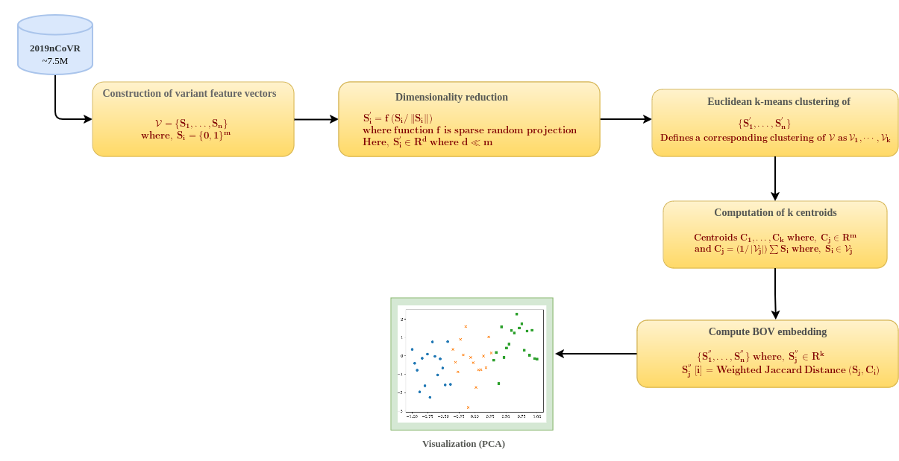

<h2 align="center"> <a href="https://arxiv.org/abs/25ff03.01463">Fast and inexpensive visualization of genome collection at scale</a></h2>
<h4 align="center" color="A0A0A0"> Naina Tiwari, Kavya Vaddadi, Vangala Govindakrishnan Saipradeep, Thomas Joseph, Aditya Rao, Rajgopal Srinivasan, Sujatha Kotte
Naveen Sivadasan</h4>
<h5 align="center"> If you like our project, please give us a star ⭐ on GitHub for the latest update.</h5>

# BOVIZ
This is the official implementation of the paper "Fast and inexpensive visualization of genome collection at scale".

  

 

We have developed a computationally efficient and scalable method, BOVIZ (Bag-Of-Variants visualization), to visualize and explore the spatiotemporal patterns present in large scale genome data. BOVIZ efficiently extracts variant level features of the strains and computes a novel and efficient Bag Of Variants (BOV) embedding to a lower dimensional space allowing the visualizations to effectively capture the similarity as well as divergence in the data. It can also support a variety of filters based on both the genomic regions of interest and the metadata such as geography, time interval and clade details.

## Update
[2025/3] Code for [MI-DETR](https://github.com/ff) is available here!

[2025/2] BOVIZ has been accepted at CVdddPR 2024 as a poster!

## Installation

We tested our code with `Python=3.10.12

# jupyter environment setup
python3 -m venv ~/jupyter_env
source ~/jupyter_env/bin/activate
 
# Upgrade pip and core tools
pip install --upgrade pip setuptools wheel
 
#Install JupyterLab, Notebook 6, widgets, and kernel
pip install notebook==6.5.4 jupyterlab ipywidgets jupyterlab_widgets ipykernel
pip install ipython==8.15.0 traitlets==5.7.1

# Under your working directory
git clone https://github.com/CQU-ADHRvdfdI-Lab/MI-DEdfdfTR.git
cd MIssds-DETR/

#Intsall required packages
pip install -r requirements.txt

## RUN
        
## plot BOV

visualization of Bag-Of-Variants embedding of samples. Execute the following,

### jupyter lab plot_BOV.ipynb

After running all the cells, three dropdown widgets will appear, namely Country, Region of interest and sample size
1)Country: multiple selection can be performed by shift+click
2)region of interest : option to choose function genomic region or the whole genomic region
3)sample size : By selecting sample size, user can set a maximum cap on the samples. e.g. if sample size is 100, 
only 100 samples will be picked from each country selected. 

After selecting all the options, simply click on run option. Once the process gets completed, user can choose different metadata fields and analyse the visualization.

## plot VE

visualization of Variant feature Embedding of all the samples. Execute the following,

### jupyter lab plot_VE.ipynb

After running all the cells, three dropdown widgets will appear, namely Country, type of plot and sample size
1)Country: multiple selection can be performed by shift+click
2)type of plot : option to choose different visualization algorithm on embedding vectors. 
3)sample size : By selecting sample size, user can set a maximum cap on the samples. e.g. if sample size is 100, 
only 100 samples will be picked from each country selected. 

After selecting all the options, simply click on run option. Once the process gets completed, user can choose different metadata fields and analyse the visualization.

## Acknowledgement

